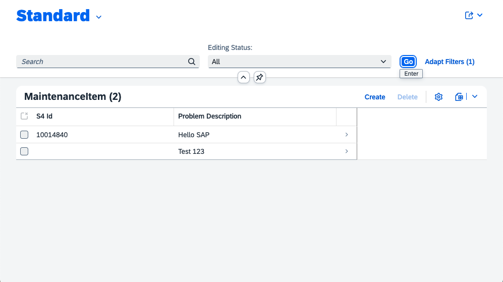
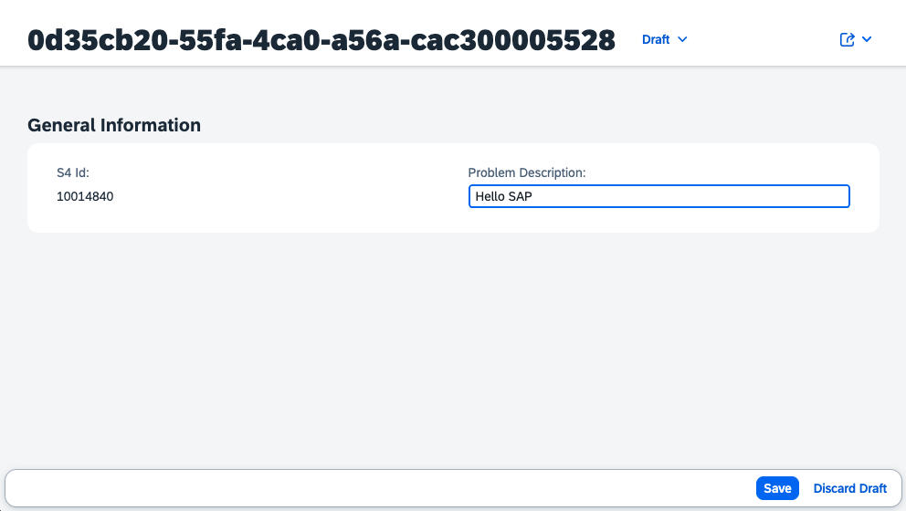

# SAP CAP Customer Step By Step Tutorial 

This Rizing tutorial provides a quick step-by-step guide to create a simple SAP CAP (Node.js) application. This app will collect the necessary information for a SAP Maintenance Notification from a customer and store it in a HANA Cloud database. 

<table width="100%"><tr><td align="center"></td><td align="center"></td></tr></table>

Before storing it in the HANA table it will create a matching Maintenance Notification in the associated SAP system. 

A more detailed description of the business context can be found here: [Business Context](./doc/context.md)

**Step-by-step instructions are provided in the [tutorial](./doc/tutorial.md).**

